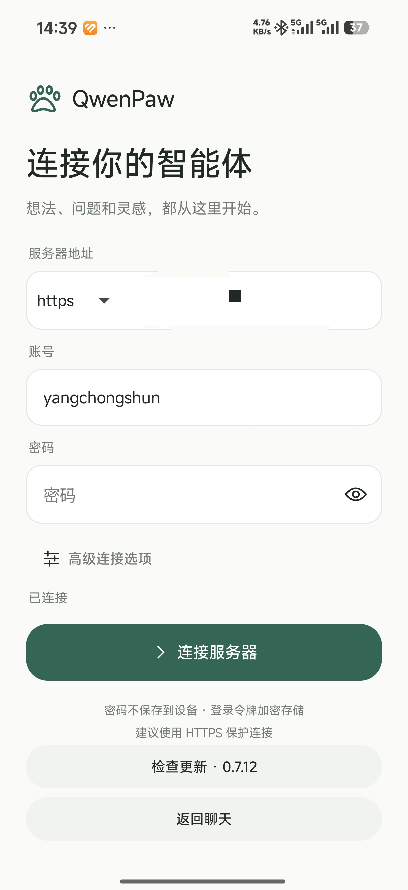
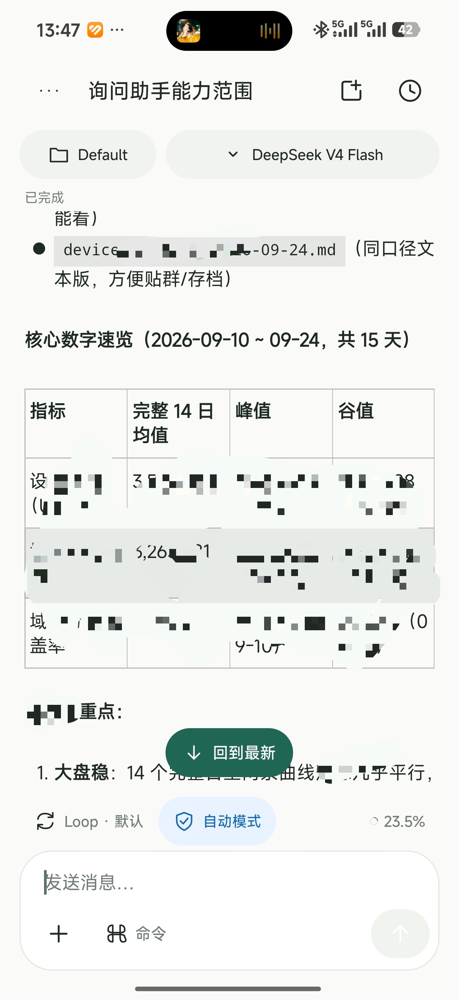
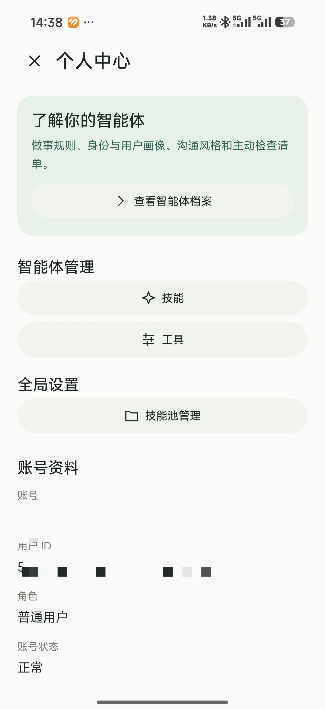
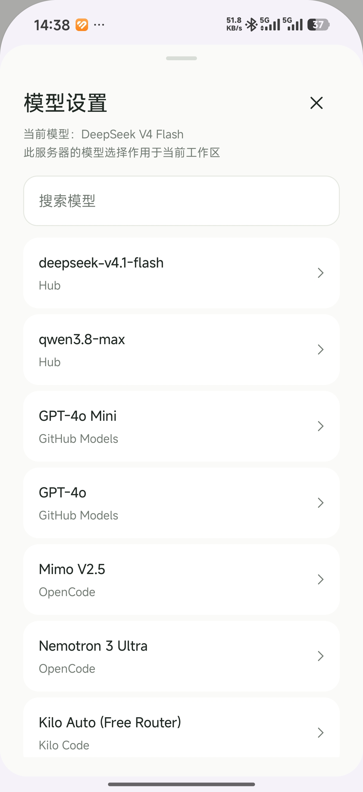
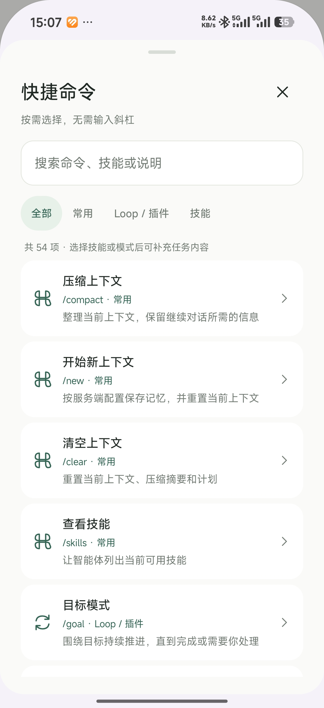
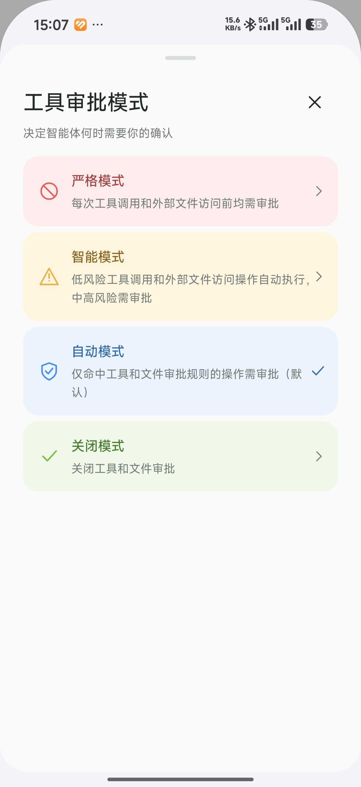
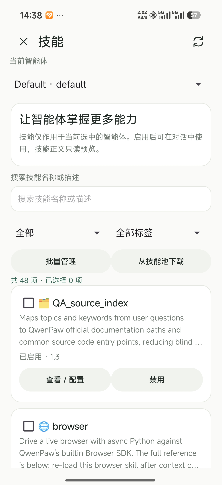
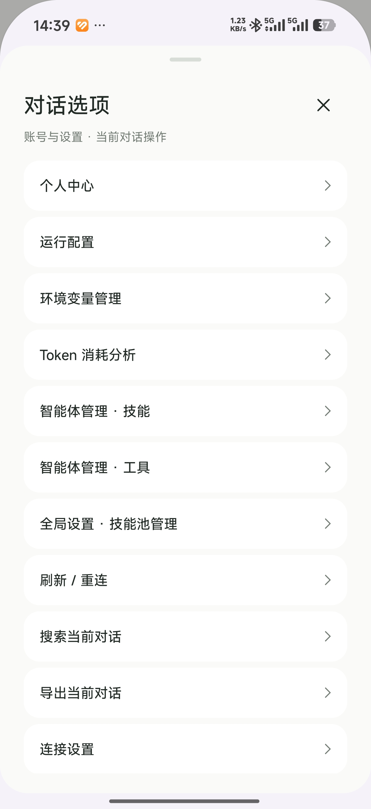
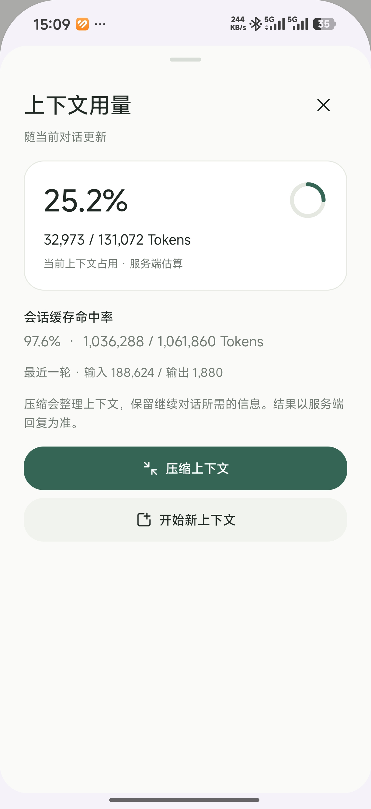

# QwenPaw Android

**Language: [简体中文](README.md) | English (current)**

QwenPaw Android is a native Android client based on the [QwenPaw](https://github.com/agentscope-ai/QwenPaw) server API. It connects to your own server for mobile chat, workspace management, and common settings. The server is not bundled; enter your server URL and account when you first sign in.

The app supports Android 8.0 (API 26) and later. The public edition uses package ID `cn.qwenpaw.android.open` and can coexist with the maintainer's personal edition.

**Public release 1.0.0:** [GitHub Releases](https://github.com/Fugitive844/QwenPaw-Android/releases/tag/v1.0.0) or the [Zealot mirror](https://app.gzsuy.vip/download/releases/25). APK SHA-256: `ef8a58eaad31d3276a7a040ac6ce463c53c4c2af243410e1d3af53819ada3ff4`; signing certificate SHA-256: `5c978fe946796168109911577c3b5ecb85ca4aa947039324dcf203e10615c7ee`.

**Server compatibility:** version 1.0.0 targets [QwenPaw v2.2.2-beta.3](https://github.com/agentscope-ai/QwenPaw/releases/tag/v2.2.2-beta.3). Compatibility with other server versions is **not guaranteed**. See the [compatibility matrix](COMPATIBILITY.md).

## Features

| Area | Implemented features |
| --- | --- |
| Connection and account | Custom HTTPS server URL, sign-in, secure token storage, profile and password changes. Remembers the server URL after sign-in; no account or personal server is preset. |
| Chat | Streaming SSE responses, stop and reconnect, search and manage history, pin, archive, rename and delete conversations, search within a conversation, copy messages, and export Markdown. |
| Models and agents | Switch workspaces and models, show reasoning controls according to server-declared capability, and inspect or adjust agent settings. |
| Tools and commands | Strict, smart, automatic, and off approval modes; tool approval actions, collapsible tool activity, Loop, and a command palette. |
| Skills and files | Browse skills and the skill pool, read Markdown content, manage settings, upload files, and preview or save chat attachments. |
| Usage | View context occupancy, token usage, and session cache hit rate; compact conversation context. |
| App updates | Configurable Zealot update source and read-only channel; check versions, download APKs, verify SHA-256, package ID, and signing certificate, then let Android confirm installation. |

The interface uses native Android controls and renders Markdown, tables, code blocks, and Mermaid diagrams. Text attachments open only when the user requests a preview; videos and HTML are handed to system apps.

## Screenshots

The maintainer supplied these screenshots of sample screens.

| Connect and profile | Chat and models |
| --- | --- |
|  |  |
|  |  |

| Commands and skills | Settings and usage |
| --- | --- |
|  |  |
|  |  |
|  |  |

## Install and build

Install the signed public APK, enter the URL of a compatible QwenPaw server, and sign in. Available features depend on the server version and account permissions. Published APKs receive a configured update channel; a source build without a channel does not check for updates automatically.

Open this repository in Android Studio with Android SDK 35 and JDK 17 or 21. For a command-line build:

```powershell
.\gradlew.bat :app:assembleDebug
.\gradlew.bat :app:testDebugUnitTest :app:lintDebug
```

Gradle properties `appEdition`, `appUpdateOrigin`, `appUpdateChannel`, and `appDefaultServer` select the edition, update origin, read-only channel, and default server URL. Public source defaults to `https://app.gzsuy.vip` for updates, with no preset server or update channel. Signing keys and publishing tokens live in private release configuration outside this repository.

## Maintenance and licenses

This is an independent client based on the [QwenPaw](https://github.com/agentscope-ai/QwenPaw) API and interaction model. QwenPaw uses Apache-2.0; original code in this repository uses [0BSD](LICENSE). Reused third-party content retains its own license. See [third-party notices](THIRD_PARTY_NOTICES.md) and `third_party`.

This is a personal hobby project. Its original client code and documentation were written entirely with GPT-6, and future updates will also use AI. The maintainer cannot promise timely updates or support for new QwenPaw versions. You are welcome to fork the repository for your own maintenance or submit a pull request.
